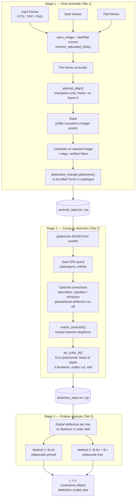
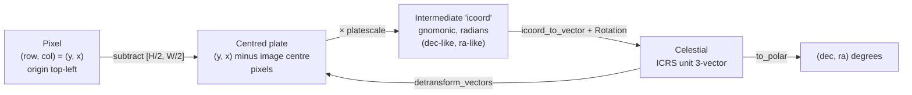
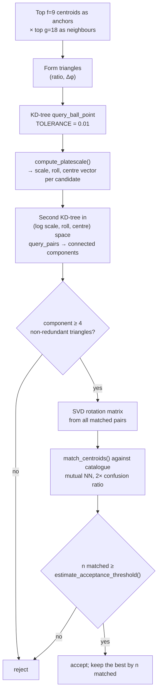

# MEE2024 — architecture and data flow

MEE2024 is the analysis pipeline for the **Modern Eddington Experiment**. It turns raw
telescope frames of a star field near the eclipsed Sun into a measurement of the
gravitational light-deflection constant `L` — the quantity general relativity predicts to
be **1.751 arcseconds** at the solar limb, falling off as `L/r` with `r` in solar radii.

At 5 solar radii the signal is only ~0.35″, so every stage of the pipeline has to hold
sub-arcsecond error. This document describes how the data flows, what each module is
responsible for, the exact on-disk contracts between stages, and where the error budget
is actually spent.

---

## 1. Top-level flow

The pipeline is **three independent stages**, one per GUI tab. Each stage writes a zip
file that the next stage reads. There is no in-process path from raw frames to `L` — every
run passes through disk.



An alternative path exists inside stage 2: with `gravity_sweep` enabled,
`gravity_sweep.py` fits `L` **simultaneously** with the plate solution by sweeping the
deflection constant fed into astropy's light-bending correction and minimising the fit
residual — bypassing stage 3 entirely.

---

## 2. Modules

| Module | Responsibility |
|---|---|
| `main.py` | Entry point; holds the master `options` default dict; GUI event loop driver |
| `UI_handler.py` | FreeSimpleGUI window: three tabs, widget↔`options` marshalling, validation |
| `stacker_implementation.py` | Stage 1 end to end: image I/O, blob masking, centroiding, alignment, stacking, output |
| `platesolve_triangle.py` | Lost-in-space plate solver: triangle hashing, consensus clustering, statistical acceptance test |
| `platesolve_new.py` | Builds the triangle pattern database (127 MB, generated once on first run) |
| `database_lookup2.py` | Tycho-2 catalogue reader (`.dat` → `.npz`) and bounding-box lookup |
| `database_cache.py` | Process-level catalogue caches; spawns the background triangle-DB preparation process |
| `gaia_search.py` | Gaia DR3 ADQL queries via astroquery (`dbs_gaia`, `lookup_nearby`) |
| `StarData.py` | Wrapper around a Gaia result table: unit vectors, proper motion, epoch propagation |
| `transforms.py` | Gnomonic projection and rotations between pixel, intermediate and celestial frames |
| `distortion_fitter.py` | Stage 2 orchestration: match, flag, fit, outlier-cut, refit, report |
| `distortion_polynomial.py` | The polynomial basis, the OLS fit itself, and epoch ("guess date") estimation |
| `refraction_correction.py` | astropy AltAz round trip; monkey-patches `erfa.ld` to switch GR deflection on and off |
| `gravity_sweep.py` | Simultaneous fit of the deflection constant and the plate solution |
| `eclipse_analysis.py` | Stage 3: radial deflection fit, covariance ellipse, report |
| `MEE2024util.py` | Config read/write, resource and user-data paths, date helpers, logging |

---

## 3. On-disk contracts

### 3.1 Stage 1 output

Directory `CENTROID_OUTPUT<ts>/` next to the chosen output folder:

```
CENTROID_OUTPUT<ts>/
  LOG<ts>.txt
  STACKED<ts>.fit                 16-bit rescaled stack
  STACKED_FLOAT<ts>.fit           optional 32-bit float stack
  DARK_STACK<ts>.fit              optional
  FLAT_STACK<ts>.fit              optional
  USEDSTARS<ts>.png               which stars drove the alignment
  TWOD_RESIDUALS<ts>.png          per-frame alignment residuals
  CentroidsALL<ts>.png            all frames' centroids, shift-corrected
  CentroidsStackGood<ts>.png      annotated stack
  triangle_matches.png            the accepted platesolve triangles
  data/
    results.txt                   JSON metadata
    STACKED_CENTROIDS_DATA.csv
    STACKED_CENTROIDS_MATCHED_ID.csv
centroid_data<ts>.zip             a zip of data/, members at the archive root
```

`results.txt` (JSON) — the fields stage 2 depends on are `img_shape`, `source_files`
and `starttime`; the rest is provenance:

| Key | Meaning |
|---|---|
| `MEE2024 version` | version string |
| `platesolved` | bool |
| `n_centroids` | detections on the stacked image |
| `img_shape` | `[height, width]` in pixels |
| `RA`, `DEC`, `roll` | degrees |
| `platescale/arcsec` | arcsec per pixel |
| `#frames stacked`, `source_files`, `starttime` | provenance |
| blob / sensitive-mode / background keys | the centroid parameters used |

> Note: the key `background stubtraction mode` is misspelled in the written output and
> must be matched exactly by any consumer.

`STACKED_CENTROIDS_DATA.csv` — **this is the file stage 2 actually consumes**:

| Column | Meaning |
|---|---|
| *(unnamed index)* | pandas row index |
| `px` | x (column) coordinate, pixels |
| `py` | y (row) coordinate, pixels |
| `area (pixels)` | connected-region area; `-1` when not in sensitive mode |
| `flux (noise-normed)` | integrated `σ`-normalised flux; `-1` when not in sensitive mode |

Rows are ordered brightest first. `STACKED_CENTROIDS_MATCHED_ID.csv` (`px, py, RA, DEC,
magV`) is the stage-1 platesolve identification and is informational only.

### 3.2 Stage 2 output

```
DISTORTION_OUTPUT<ts>__<basename>/
  Error_graphs.png                4-panel residual diagnostics
  distortion/
    distortion_results.txt        JSON
    CATALOGUE_MATCHED_ERRORS.csv
distortion_data<ts>__<basename>.zip
```

`distortion_results.txt` — the fields stage 3 depends on are marked ★:

| Key | Meaning |
|---|---|
| ★ `platescale (arcseconds/pixel)` | fitted plate scale |
| ★ `platescale_relative_uncertainty` | relative 1σ, from the OLS heteroskedasticity-robust SE |
| ★ `observation_date`, `observation_time (UTC)` | needed to place the Sun and Moon |
| ★ `observation_lat/long/height (degrees, m)` | observer location |
| ★ `gravitational correction enabled?` | stage 3 warns if this was on |
| `final rms error (arcseconds)` | headline fit quality |
| `#stars used` | after outlier rejection |
| `RA`, `DEC`, `ROLL` | degrees |
| `distortion order`, `distortion coeffs x/y` | the fitted polynomial |
| `nearest-neighbour error correlation` | systematic-residual indicator |
| `date_guessed?`, `mirror?`, `crop_circle`, correction flags | provenance |

`CATALOGUE_MATCHED_ERRORS.csv` — one row per matched star, **before** outlier rejection:

| Column | Meaning |
|---|---|
| `px`, `py` | measured pixel position |
| `px_dist`, `py_dist` | distortion-corrected pixel position |
| `ID` | `gaia:<source_id>` |
| `RA(catalog)`, `DEC(catalog)` | catalogue position, degrees, propagated to epoch |
| `RA(obs)`, `DEC(obs)` | observed position through the fitted solution, degrees |
| `magV` | Gaia G magnitude |
| `error(")` | residual, arcseconds |
| `flag_is_double`, `flag_missing_pm`, `flag_is_outlier` | exclusion flags |

### 3.3 Stage 3 output

`ECLIPSE_OUTPUT<ts>.txt` (plain text report), `ECLIPSE_confidence_ellipse<ts>.png`, and
`ECLIPSE_DEFLECTIONS_corrected<method><ts>.png`.

### 3.4 Configuration

A single flat JSON dict of ~70 keys, stored at
`platformdirs.user_config_dir("MEE2024", "MEE2024")/MEE_config.txt`, rewritten on every
run. Defaults live in `main.py`; `read_ini` merges the file over them, so a config missing
new keys still works. The bundled `MEE_config.txt` files in the repository are stale
leftovers from before the move to `user_config_dir` (commit `39e66f3`).

The triangle pattern database lives at
`platformdirs.user_data_dir(...)/TripleTrianglePlatesolveDatabase/TripleTriangle_pattern_data.npz`
and is generated on first launch if absent.

---

## 4. Coordinate conventions

This is the single most error-prone part of the codebase. Four frames are in play.



Rules that hold throughout:

- **Arrays are `(y, x)`.** Centroids, plate coordinates and `detransform_vectors` output
  all put the row coordinate in column 0. The CSV columns `px`/`py` invert this
  (`px = column 1`, `py = column 0`), and so does the `(x, y)` convention used inside
  `platesolve_triangle.match_triangles_inner`, which builds
  `np.c_[centroids[:,1], centroids[:,0]]`.
- **`to_polar` returns `(dec, ra)`**, in that column order, in **degrees**.
- **The solution 4-tuple `x` is `(platescale, ra, dec, roll)` in radians**, with
  platescale in radians per pixel. `platesolve()` also returns human-facing `ra`, `dec`,
  `roll` in degrees and `platescale/arcsec` separately.
- **Magnitudes**: the bundled Tycho catalogue is V-band; Gaia is G-band. The column is
  called `magV` in both output CSVs regardless of source.
- **Angles in options**: `rough_match_threshhold` and `double_star_cutoff` are in
  **arcseconds**; `distortion_fit_tol` is in arcseconds; `theta_*` constants in
  `platesolve_new.py` are in radians.

### Unexplained roll offsets

Three constant roll offsets are applied with comments admitting they are not understood.
They cancel in the current call graph, but any change to the projection code must
preserve them together:

| Location | Code | Comment in source |
|---|---|---|
| `platesolve_triangle.py:360` | `np.degrees(roll[el]) + 90` | "this plus 90 is very weird and probably is need because of a coordinate bug" |
| `platesolve_triangle.py:374` | `acc_roll = (acc_roll + 180) % 360` | "???" |
| `platesolve_triangle.py:380` | `acc_roll + 180` | "do weird +180 roll thing as usual" |
| `distortion_fitter.py:264` | `np.degrees(result[3]) - 180` | "TODO: clarify this dodgy +/- 180 thing" |

---

## 5. How the plate solver works

`platesolve_triangle.platesolve()` is a lost-in-space solver — no prior pointing needed.

**Offline (once, `platesolve_new.generate()`):**

1. Choose *anchor* stars: the 80 000 brightest Tycho entries, plus any of the next
   160 000 that are more than `theta_sep = 0.4°` from a brighter star.
2. For each anchor, record its 18 brightest neighbours within `theta_pat = 1.7°` as
   `(Δθ, φ, unit vector)`.
3. For each anchor, form all 18·17/2 = 153 triangles and store each as a
   **scale- and rotation-invariant** pair `(radius ratio, angular separation)`.

Result: `anchors`, `pattern_data`, `pattern_ind`, `triangles` in a 127 MB `.npz`, indexed
at load time by a KD-tree with a 2π-periodic second axis.

**Online, per image:**



The acceptance test is the interesting part. `estimate_acceptance_threshold()` computes
how many chance matches you would expect given the catalogue density, the match radius
and the number of triangle-matching attempts, modelling the count as the maximum of a set
of Poisson variables (Briggs–Song–Prellberg) and solving with the Lambert W function. The
solve is accepted only if the observed match count exceeds that, plus an empirical margin
of 3. This is why the solver can honestly report failure instead of returning a plausible
wrong answer.

If no solve is found, the whole thing is retried once with x and y transposed, to
tolerate a mirrored image.

---

## 6. Error budget — where sub-arcsecond precision is won and lost

| Stage | Current method | Limiting factor |
|---|---|---|
| **Centroiding** | Flux-weighted centre of mass over a thresholded, background-subtracted, noise-normalised image (`get_centroids_blur`), or a simplified Tetra-style COM (`simple_get_centroids`) | No PSF model. COM is biased for asymmetric, saturated or undersampled stars, and its variance is higher than a matched-filter fit at the same S/N. |
| **Stacking** | Alignment shifts are **rounded to whole pixels** (`add_img_to_stack`) | Up to 0.5 px of asymmetric smear per frame. The final centroids come from this stacked image, so the bias propagates directly into every position. |
| **Alignment model** | Translation only | No rotation, scale drift or differential refraction between frames. Fine for short sequences, questionable across a long eclipse totality. |
| **Plate solve** | Triangle hash over a strict top-9-by-flux anchor prefix | One spurious bright detection (hot pixel, cosmic ray, moon artifact) poisons every triangle. Fields wider than ~2·1.7° have their bright stars outside every anchor's pattern radius. |
| **Distortion** | OLS polynomial, linear→septic, iterated three times, outliers cut at `distortion_fit_tol`, then refit | Sound. The residual it reports is dominated by centroid noise, not by the model. |
| **Catalogue** | Gaia DR3 queried online per run | Slow, needs internet, and makes offline/CI reproduction impossible. Proper motion is propagated server-side by `ESDC_EPOCH_PROP_POS`. |
| **Astrometric corrections** | astropy AltAz round trip for aberration, parallax and refraction; `erfa.ld` monkey-patched to control GR deflection | Refraction depends on user-entered pressure/temperature/humidity/wavelength; errors here are systematic and correlated across the field. |

The headline quality number the pipeline already produces is
`final rms error (arcseconds)` in `distortion_results.txt`, and the naive precision on the
deflection constant is `rms / sqrt(n_stars)` — computed in both `eclipse_analysis.py` and
`gravity_sweep.py`.

---

## 7. Startup and caching behaviour

`main()` calls `database_cache.prepare_triangles()` before anything else, which forks a
process that loads (or, on first run, generates) the 127 MB triangle database while the
user is still filling in the GUI. `open_catalogue()` blocks on a 1-second polling loop
until that process delivers. Catalogues are cached per path in `database_cache._cache`
for the process lifetime, so repeated tab-2 runs reuse one Gaia session but still re-query
per field.
